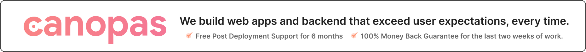

<p align="center"><a href="https://canopas.com/contact"></a></p>

# Web File Management with Preview - Fully Customized

A versatile and user-friendly file management system built for Vue and React that allows single and multiple file uploading with a preview feature, returning an array of selected files. It supports custom designs by overriding the style classes.


---

### The library provides support for Vue and React. Each has its own set of features and information. Explore the individual folders for more details.

## Vue File Upload

This folder includes files and resources related to the Vue file upload library. and also, it has [demo](./vue/examples/demo/) project. so, it's easy to understand and you can use it directly.

Checkout the live demo on, codesandbox <br /><br />
[](https://codesandbox.io/p/sandbox/cranky-breeze-r4hht7?file=%2Fsrc%2Fmain.js)

For more details, check out the [Vue README](./vue/README.md).

## React File Upload

This folder includes files and resources related to the React file upload library. and also, it has [demo](./react/examples/demo/) project. so, it's easy to understand and you can use it directly.

Checkout the live demo on, codesandbox <br /><br />
[](https://codesandbox.io/p/devbox/eager-mountain-n4zgs6?file=%2Fsrc%2FApp.tsx)

For more details, check out the [React README](./react/README.md).

Feel free to explore each folder for specific information about Vue and React!

---

## Table of Contents

  - [Features](#features)
  - [Installation](#installation)
    - [Vue](#vue)
    - [React](#react)
  - [Examples](#examples)
    - [Canvas View](#canvas-view)
    - [Square View](#square-view)
    - [Horizontal Long Square View](#horizontal-long-square-view)
    - [Circular View](#circular-view)
    - [Over-ride CSS](#over-ride-css)
  - [Contributing](#contributing)
  - [Credits](#credits)
  - [License](#license)

---

## Features

- **Single File Upload:** Users can upload or change a single file.
- **Multiple File Management:** Easily manage multiple files.
- **File Preview:** Provides a preview of uploaded files (e.g., images, videos, gifs).
- **Responsive Design:** Ensures a seamless experience on various devices.
- **Fully customized:** Customize file upload UI as per your requirements

---

## Installation

### Vue

Using npm:

```
npm install @canopassoftware/vue-file-upload
```

Using yarn:

```
yarn add @canopassoftware/vue-file-upload
```

---

### React

Using npm:

```
npm install @canopassoftware/react-file-upload
```

Using yarn:

```
yarn add @canopassoftware/react-file-upload
```

---

## Examples

We are providing some examples with design. so, you can easily take it and use into your project.

### Canvas View

vue - [view code](./vue/examples/CanvasView.vue) <br>
react - [view code](./react/examples/CanvasView.tsx)


### Square View

vue- [view code](./vue/examples/SquareView.vue) <br>
react - [view code](./react/examples/SquareView.tsx)


### Horizontal Long Square View

vue - [view code](./vue/examples/LongSquareView.vue) <br>
react - [view code](./react/examples/LongSquareView.tsx)


### Circular View

vue - [view code](./vue/examples/RoundView.vue) <br>
react - [view code](./react/examples/RoundView.tsx)


### Over-ride CSS

For over-riding the design of default buttons, you can over-ride it's CSS by class name. <br>
For example., <br>

- Over-ride CSS of remove file button you can add it like,

```css
.remove-btn {
  color: white;
  background-color: red;
  font-size: 25px;
  padding: 5px;
}
```

- Over-ride CSS of submit/upload file button you can add it like,

```css
.upload-btn {
  color: white;
  background-color: rgb(51, 65, 85);
  font-size: 25px;
  padding: 5px 10px;
}
```

---

## Contributing

We welcome contributions from the community. To contribute to this project, please follow these guidelines:

- Fork the repository.
- Create a new branch for your feature or bug fix.
- Make your changes and commit them.
- Push your changes to your fork.
- Submit a pull request with a clear description of your changes.
- Please ensure your code follows the project's coding standards and includes appropriate documentation.

---

## Credits

This repository is owned and maintained by the [Canopas team](https://canopas.com/). If you are interested in building web apps or designing products, please let us know. We'd love to hear from you!

<a href="https://canopas.com/contact"></a>

---

## License

This project is licensed under the [MIT](https://github.com/canopas/web-file-upload/blob/main/LICENSE).
